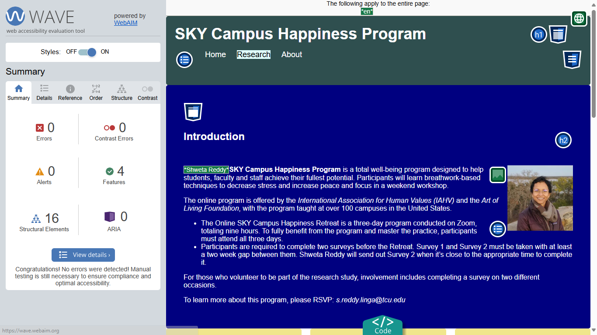

# 60970 - Final portfolio

## About my project
- My project is a website called **SKY Campus Happiness Program**.
- **SKY Campus Happiness Program** is a total well-being program designed to help students, faculty and staff achieve their fullest potential.
- My website provides details about the program content, how it will be conducted, when it is being offered, and the requirements to complete the program.
- My website also provides background information about the instructors who are conducting this program.

## Accessibility Check
Accessibility check was performed using [WAVE - Web Accessibility Evaluation Tools](https://wave.webaim.org/).

Below are the results from the testing performed on my website using WAVE. There are **zero** errors, contrast errors, or alerts on all the pages.

### WAVE test result for Home page

### WAVE test result for Research page

### WAVE test result for About page

## Reflection
Prior to taking this course, I had no knowledge of how websites were developed. This course introduced me to a foreign world of HTML and Cascading Style Sheets (CSS). It helped me understand how desktop versions of websites are very different from the mobile versions of websites. It taught me how to transform the desktop version of my website into a mobile-friendly version. I learnt how to incorporate responsive design into my website to enable it to work on all devices. 
Many websites assume that more information is better, overlooking the fact that website users tend to get lost when there is information overload, leading to frustration and eventually forcing them to explore other resources. Accessibility is another area of website development that tends to take a backseat and is more often than not provided as an afterthought, leading to shabbily designed and hard to use websites. This course taught me how to use modern layout techniques to make my website easily navigable and to implement accessibility by providing alternative text, keyboard navigation, device appropriate colors and fonts etc.
I intend to leverage this learning in my future website development endeavors.

## View the website
[60970](https://htmlpreview.github.io/?https://github.com/ShwetaR2025/60970/blob/main/final-portfolio/index.html)
